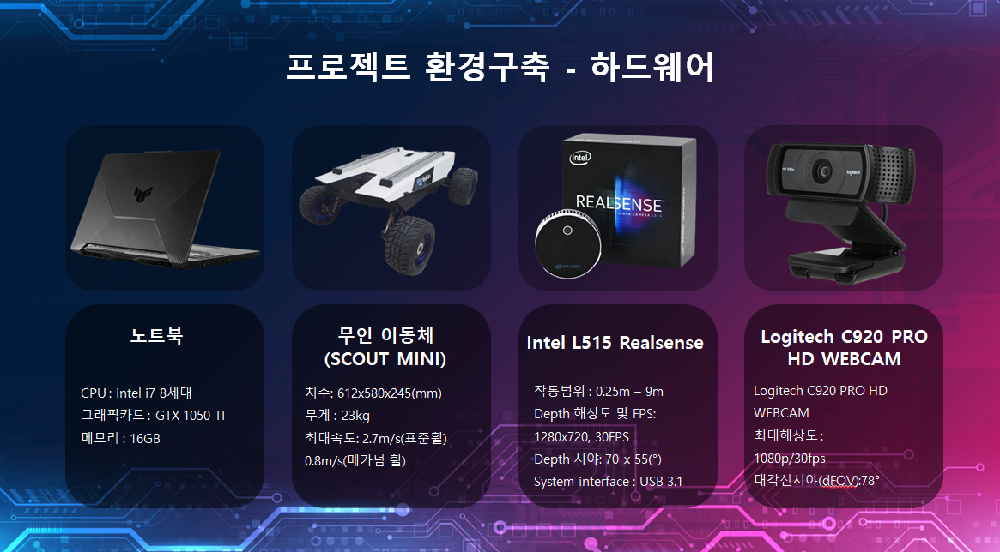

# 인공지능을 탑재한 자율주행 물류시스템 (Python, C++, ROS 활용)
# 프로젝트는 아래와 같이 두가지를 진행함
# P1. Line_detect 최종 완주영상 보기 <<https://youtu.be/rOKRH1QHNEM>>
# P2. SLAM 최종 완주영상 보기 <<https://youtu.be/sEXM2UTHPX0>>

* 학습 및 프로젝트 기간 : * 2022. 01. 18. ~ 2022. 07. 09

## 환경구축 (P1, P2 동일)

  

  

## P1. Line_detect

1. Line detection 알고리즘 ( Open CV 라이브러리 사용 )
 * cvtColor 함수 : 영상을 gray스케일로 변환
 * boxFilter 함수 : 노이즈를 제거하기 위해서 사용
 * Threshold 함수 : 영상을 임계값 기준으로 흑/백 으로 분류
 * Canny함수 : 경계선(선) 검출
 * HoughLinesP 함수(허프변환) : 직선으로 검출된 Line의 양 끝점을 (x1, y1, x2, y2) 형식으로 data 추출
 * 검출된 각 Line의 x값의 평균 값을 활용하여 무인이동체가 라인을 따라 움직이도록 구현

2. QR코드 생성 및 인식 ( Open CV 라이브러리 사용)
 * QR코드 생성(Start, A, B, C)
 * 웹캠1에서 Start QR을 인식하면, 무인이동체 정지
 * 웹캠2에서 A or B or C QR을 인식하면, 인식된 QR 위치로 이동 후 정지
 * 인식된 QR의 위치로 도착 후, 웹캠2의 QR을 제거하면 주행 재개

3. 장애물 검출 및 장애물 회피 알고리즘 (자율주행)
 * 3D 라이다 센서의 depth값을 사용
 * depth값에 따라 영상 각 픽셀에 “ ,1 ,2 ,3 ,4 ,5 ,6 ,7 ,8” 로 표시되도록 알고리즘 설계
 * 알고리즘에 의해 표시된 값으로 장애물 유 무 판단
 * 장애물을 회피하도록 무인이동체의 속도와 각도를 제어

## P2. SLAM

1. SSL_SLAM-ROS패키지 사용
 * 인텔 L515 3D 라이다 센서에 적용 가능한 SSL_SLAM 패키지 사용.
 * 다른 패키지(RTABMap, Gmapping등) 사용해 보려고 했으나,
 * RTABMap은 오류와 오차가 많아서 사용하지 않았고,
 * Gmapping은 우리가 사용한 3D 라이다 센서에는 적합하지 않았음

2. Odometry활용
 * Odometry의 nav_msgs를 활용해 L515의 현재 위치 좌표 값을 사용
 * Quaternion to euler 변환을 통해 L515의 방향 축을 직관적으로 파악하고, 무인이동체의 방향을 제어

3. 피타고라스 정리
 * 시작 위치와 각 지점 A, B, C 위치간의 거리, 각도를 피타고라스 정리로 계산
 
4. QR코드인식 ( Open CV 라이브러리 사용 )
 * QR코드 생성(A, B, C)
 * 주행시 각 A, B, C 위치에서 QR을 인식
 * 웹캠에서 A or B or C QR을 인식하면, 인식된 QR의 장소로 이동 후 정지
 * 웹캠이 인식한 QR을 제거하면, 시작점(0, 0)으로 복귀

5. 장애물 검출 및 장애물 회피 알고리즘(자율주행)
 * 3D 라이다 센서의 depth_raw_data를 사용
 * depth_raw_data는 YUY2형식으로 되어 있으며, 파이썬에서 bytearray를 사용하여 값을 가공함
 * 가공된 depth값에 따라 영상 각 픽셀에 “ , 1, 2, 3, 4, 5, 6, 7, 8, 9” 로 표시되도록 알고리즘 설계
 * 알고리즘에 의해 표시된 값으로 장애물 유 무 판단
 * 장애물을 회피하도록 무인이동체의 속도와 각도를 제어

